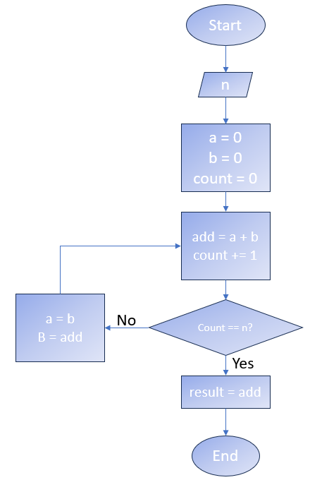

## Logica de Programacion
### Escenario 1

Determina el resultado del diagrama cuando `count = 8`:



### Escenario 2
Identifica los errores en el codigo siguiente:

```java 
 
import java.io.*;
 
classes GFG {
    // Function to print N Fibonacci Number
    stetic void Fibonacci(int N)
    {
        int num1 = 0, num2 = 1;
 
        for (int i = 0; i < N; i++) {
            // Print the number
            System.out.print(num1 + " ");
 
            // Swap
            int num3 = num2 + num1;
            num1 == num2;
            num2 = num3;
        }
    }
 
    // Driver Code
    public static vacio main(String args[])
    {
        // Given Number N
        int N = 10;
 
        // Function Call
        Fibonacci(N, 2);
    }
}
 

```
## Tablas de verdad
### Escenario

Se te proporcionará una tabla de verdad que describe el comportamiento lógico de una función. Escribe la función booleana simplificada a partir de la tabla (elige cualquiera de las tablas siguientes).


### EXTRA 
Representa el circuito lógico que implementa la función booleana simplificada.

## Linux Test

### Escenario
Se te pidio descargar un binario y ejecutarlo para corroborar que funciona correctamente. Sin embargo, solo tienes acceso al OS desde la linea de comandos. 
Para lograrlo, se te proprocionaron los siguientes comandos:


```bash
$ wget <url>/binary.bin
$ chmod +x binary.bin 
$ ./binary.bin
```
### Ejercicios

En base al escenario anterior, responde los siguientese ejercicios

1. El binario funciona correctamente. Tu mision es moverlo para que sea ejecutable globalmente. Guiate en el siguiente diagrama para realizarlo:

```bash
/📂
├── 📂usr 
│   └── 📁local 
│       └── 📁bin # your binary should be here
└── 📂home 
    └── 📁 user
        └── 📃 binary.bin # your binary is here
```
2. Explica que acciones realizan los comandos que elegiste

### Puntos extra
3. Para que se utiliza el comando `wget`?
4. Que cambios realizó el comando `chmod` en el archivo descargado?