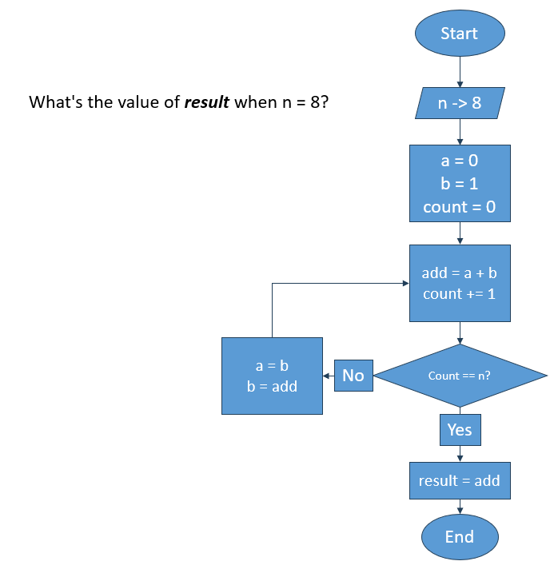

## Logica de Programacion
### Escenario 1

Determina el resultado del diagrama cuando `n = 8`:



result = 34

### Escenario 2

Identifica los errores en el codigo siguiente:
```java
import java.io.*;

class GFG {
    // Function to print N Fibonacci Number
    public static void Fibonacci(int N)
    {
        int num1 = 0, num2 = 1;
 
        for (int i = 0; i < N; i++) {
            // Print the number
            System.out.print(num1 + " ");
 
            // Swap
            int num3 = num2 + num1;
            num1 == num2;
            num2 = num3;
        }
    }
 
    // Driver Code
    public static void main(String args[])
    {
        // Given Number N
        int N = 10;
 
        // Function Call
        GFG.Fibonacci(N, 2);
    }
}
```
1.- Sintaxis: classes -> class

2.- Sintaxis: stetic -> static

3.- Sintaxis: añade public a método Fibonacci

4.- Sintaxis: vacio -> void

5.- Acceso: Fibonacci(N, 2) -> GFG.Fibonacci(N, 2)

## Tablas de verdad
### Escenario

Se te proporcionará una tabla de verdad que describe el comportamiento lógico de una función. Escribe la función booleana simplificada a partir de la tabla (elige cualquiera de las tablas siguientes).


### Tabla 1
Por mintérminos:

Fn = (A + B! + C! + D)(A! + B! + C! + D!)

Fn =  B! + C! + A!D + AD!

## Linux Test

### Escenario
Se te pidio descargar un script y ejecutarlo para corroborar que funciona correctamente. Sin embargo, solo tienes acceso al OS desde la linea de comandos. 

En base al escenario anterior, responde los siguientese ejercicios

### Ejercicios

1. Necesitarás obtener el ejecutable de la url `https://example.com/executables/my_program.sh`. Escribe a continuacion tu script:

```bash
wget https://example.com/executables/my_program.sh

```
2. El binario funciona correctamente. Tu mision es moverlo para que sea ejecutable globalmente. Guiate en el siguiente diagrama para realizarlo:

```bash
/📂
├── 📂usr 
│   └── 📁local 
│       └── 📁bin # your program should be here
└── 📂home 
    └── 📁 user
        └── 📃 my_program.sh # your program is here
```

```bash
mv /home/user/my_program.sh /usr/local/bin

```
### Puntos extra
3. Explica que acciones realizan los comandos que elegiste en ambos ejercicios

wget descarga de la pagina seleccionada el archivo my_program.sh
mv mueve el archivo desde la carpeta de user hasta la carpeta usr/local/bin, donde podrá ser accedido globalmente

## Testing

Imagina que tienes como producto una bicicleta nueva. Se te ha encargado probar los frenos. Describe como harias una prueba para corroborar si funcionan correctamente. Indica tres parametros para validar su funcionamiento

1. Detectar el movimiento del martillo

2. Detectar el contacto con la llanta

3. Hacer una prueba a baja velocidad y medir la desaceleración.


